# Validating the Marketplace (Slices 1–4) — Local Anvil & Hosted Sepolia

> Audience: every team member. Sections **A–B** validate **Slice 1** (the EnigCredit token); sections
> **C–D** validate the **Slices 2–4 lifecycle** (list → buy/escrow → confirm → rate). Both use the same
> two networks and the same GUI:
>
> | Network | GUI you use | Why |
> |---|---|---|
> | **Local Anvil** (chainId 31337) | the page served **locally** at `http://localhost:8080` | local HTTP ↔ local chain — no browser security limits |
> | **Hosted Sepolia** (chainId 11155111) | the **GitHub Pages** site `https://<user>.github.io/Enigma-Decentralized-Student-Marketplace/` | public HTTPS page ↔ public HTTPS RPC |
>
> **Golden rule — only the contract *owner* can `mint`.** The owner is whoever **deployed**:
> on Anvil that's account[0] (`0xf39F…2266`); on Sepolia it's the wallet you deployed with.
> A non-owner `mint` reverts with `execution reverted … CALL_EXCEPTION` (the `onlyOwner` guard).

---

## A · Local Anvil Network Test

Realistic local-dev flow: run a throwaway chain, deploy, serve the page, drive it with MetaMask.

### A1. Start the chain & deploy
```bash
# terminal 1 — local chain (accounts pre-funded, deterministic addresses)
anvil

# terminal 2 — deploy from the repo root (account[0] = deployer = owner)
forge script script/Deploy.s.sol:Deploy \
  --rpc-url http://127.0.0.1:8545 \
  --broadcast \
  --sender 0xf39fd6e51aad88f6f4ce6ab8827279cfffb92266 \
  --unlocked
```
Because account[0] deploys in a fixed order, the printed addresses match the **`anvil` block in
`frontend/src/shared/config.js`** out of the box (EnigCredit `0x5fbd…80aa3`). The constructor mints the
**1,000,000 ENGC** initial supply to the deployer.

### A2. Serve the GUI
```bash
cd frontend/src && python3 -m http.server 8080
```

### A3. Point MetaMask at the local chain
- Add a network: RPC `http://127.0.0.1:8545`, **chainId 31337**, then **import account[0]'s private key**
  (Anvil prints it on startup) as the owner.
- ℹ️ MetaMask labels chainId 31337 as **"GoChain Testnet"** with a **"GO"** symbol — that's cosmetic
  (GoChain's testnet shares the chainId). It's still your local Anvil chain; the "GO" gas is fake.

### A4. Connect & mint
Open **`http://localhost:8080/modules/token/index.html`**, choose **"Local Anvil (dev)"** in the Network
dropdown, **Connect wallet** (balance shows your ENGC), then fill the mint form and **Mint ENGC** →
MetaMask **Confirm**.

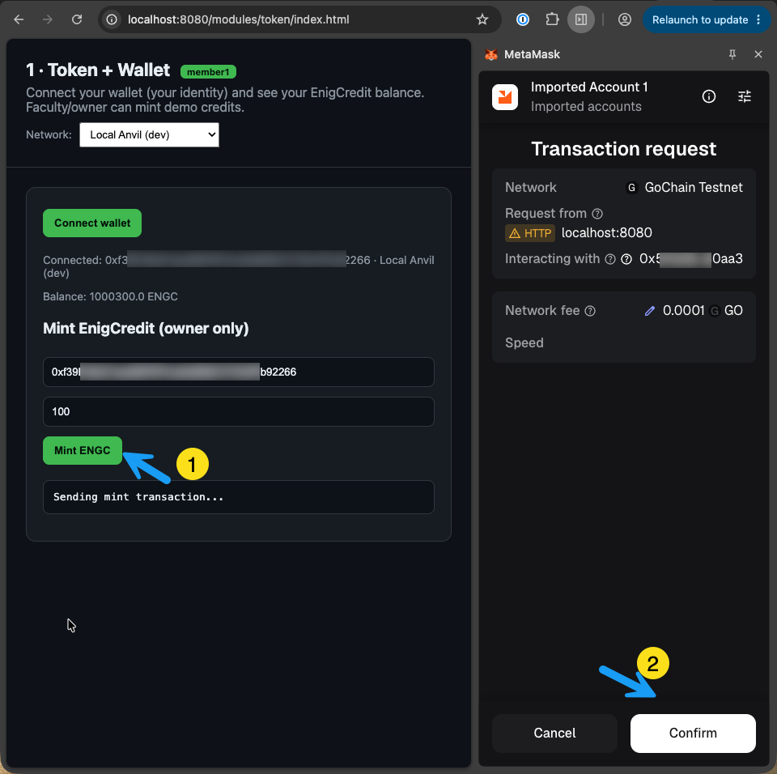

On success the page prints `✅ Minted … New balance: …`. Switch MetaMask to a **non-owner** account and
try again → it reverts with `CALL_EXCEPTION` (proof the `onlyOwner` guard works).

> ✅ **Validated:** owner mint succeeds, balance updates, non-owner mint is rejected — all on your local chain.

---

## B · Hosted Sepolia Network Test (GitHub Pages)

Same contract and UI on a **public** testnet, driven through the **hosted** site. Reads/writes are real
on-chain transactions.

### B1. A funded deployer wallet
Create a **throwaway** MetaMask account (this becomes the Sepolia owner) and fund it with Sepolia ETH.

⚠️ **Faucet gotcha:** the **Alchemy faucet requires a mainnet balance** — a fresh wallet is rejected with
*"Insufficient balance! You need at least 0.001 ETH on Ethereum Mainnet."*

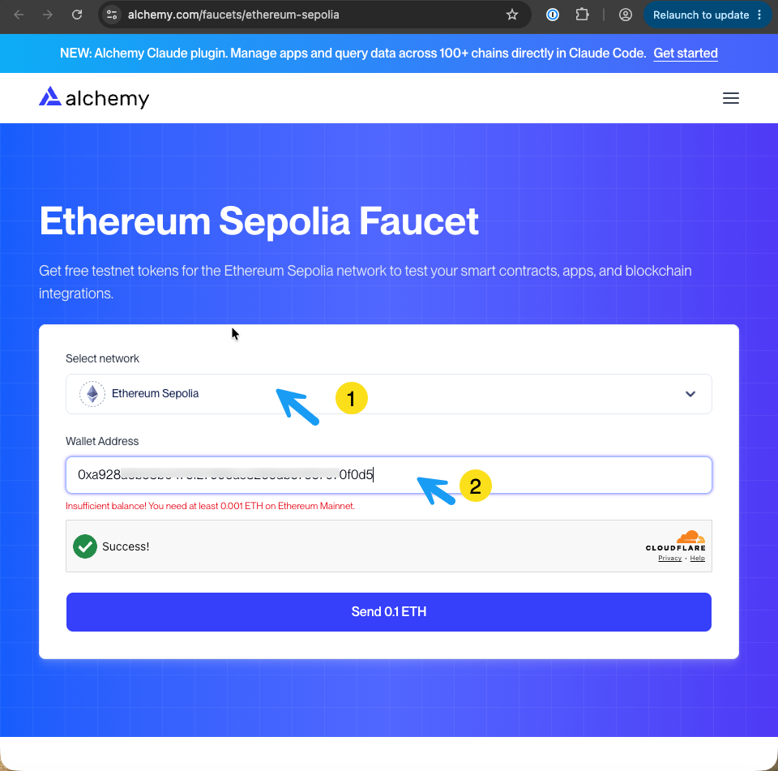

Use a **no-gate** faucet instead — [pk910 PoW](https://sepolia-faucet.pk910.de) (mine in-browser) or the
[Google Cloud faucet](https://cloud.google.com/application/web3/faucet/ethereum/sepolia).

### B2. Get a Sepolia RPC (Alchemy)
In your Alchemy app, enable **Ethereum Sepolia** and copy the **Endpoint URL**
(`https://eth-sepolia.g.alchemy.com/v2/<key>`). ⚠️ Make sure it says **`eth-sepolia`**, not `eth-mainnet`,
and **never commit the key**.

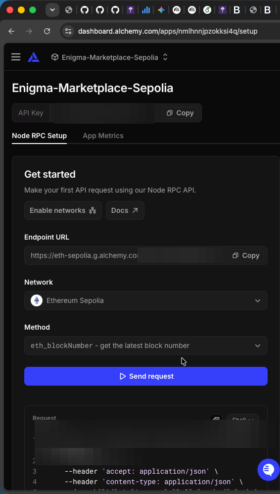

### B3. Deploy to Sepolia
Store the key securely (`cast wallet import sepolia-deployer --interactive`), then:
```bash
export SEPOLIA_RPC_URL="https://eth-sepolia.g.alchemy.com/v2/<key>"
forge script script/Deploy.s.sol:Deploy \
  --rpc-url sepolia \
  --account sepolia-deployer \
  --broadcast
```

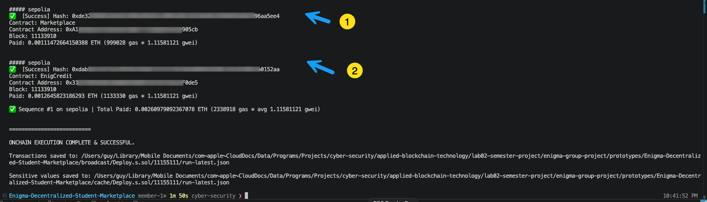

Paste the three printed addresses into the **`sepolia` block** of `config.js`.

### B4. Publish the GUI to GitHub Pages
Commit the updated `config.js` (+ `abi.js`), then on **your fork**: **Settings → Pages → Source = GitHub
Actions**, and run the **"Deploy Pages"** workflow. The app publishes to
`https://<user>.github.io/Enigma-Decentralized-Student-Marketplace/`.

### B5. Connect & mint on the hosted site
Open the hosted **`/modules/token/index.html`**, choose **"Sepolia (hosted demo)"**, switch MetaMask to
**Sepolia**, and **Connect** the owner wallet.

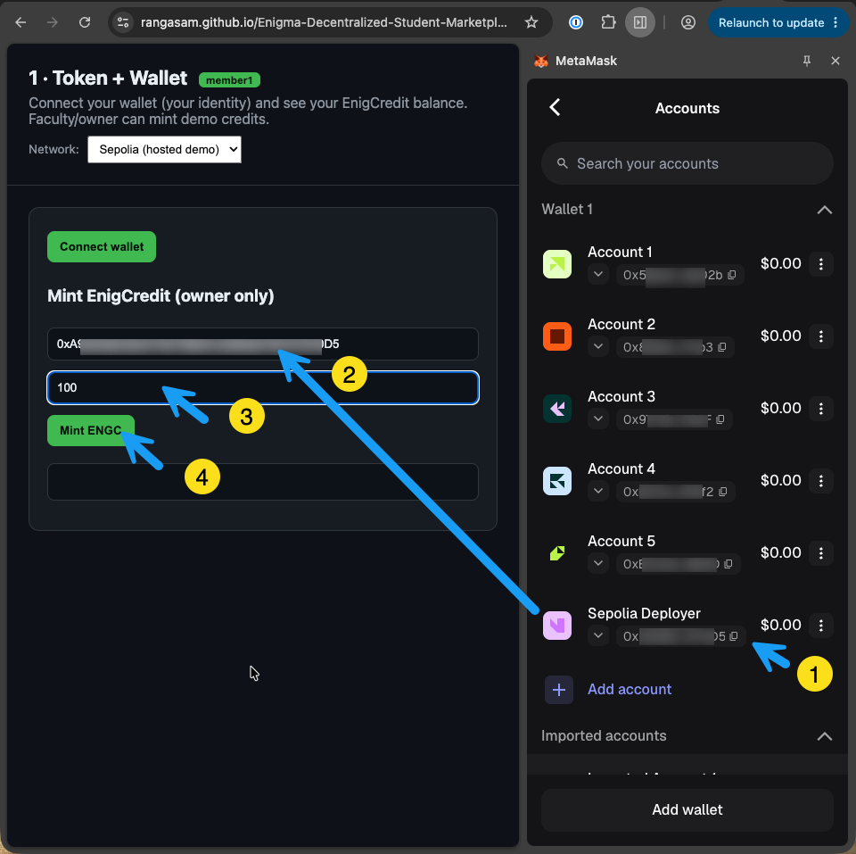

Fill the mint form → **Mint ENGC** → MetaMask **Confirm** (this spends real Sepolia gas, ~12–15s to
confirm).

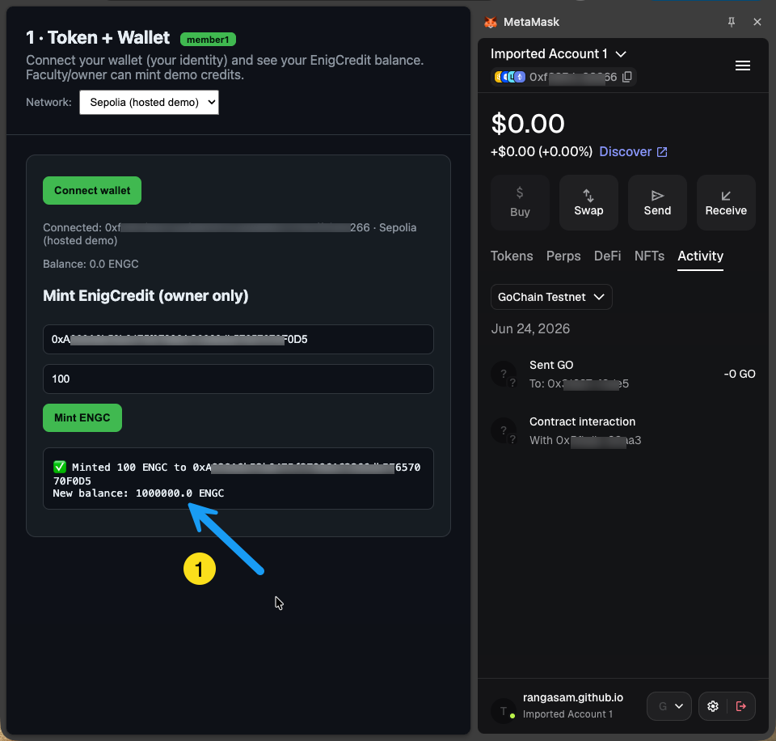

Confirm independently on **[Sepolia Etherscan](https://sepolia.etherscan.io)** (read `owner`,
`totalSupply`, `balanceOf`). A non-owner mint reverts with `CALL_EXCEPTION`, exactly as on Anvil.

> ✅ **Validated:** the live Sepolia contract mints for the owner, rejects non-owners, and the hosted GUI
> reads/writes it correctly.

---

## C · Marketplace Lifecycle Test (Slices 2–4) — Local Anvil

Slices 2–4 are one flow: **Member 2** lists an item → **Member 3** escrows the trade → **Member 4** records
reputation. Validate them as a single lifecycle with **three roles**: **owner** (deployer, account[0]),
**seller** (account[1]), **buyer** (account[2]).

> **Golden rule — value is escrowed, not sent.** `purchaseItem` pulls the price into the *contract*; it is
> released to the seller **only** on the buyer's `confirmDelivery`, or refunded to the buyer via
> `cancelPurchase` after the timeout. No party can extract value early.

### C1. CLI walkthrough (reproducible — verified)
Start the chain and deploy as in **§A1** (addresses match the `anvil` block of `config.js`), then set:
```bash
RPC=http://127.0.0.1:8545
ENG=0x5FbDB2315678afecb367f032d93F642f64180aa3      # EnigCredit
MK=0xe7f1725E7734CE288F8367e1Bb143E90bb3F0512        # Marketplace
RP=0x9fE46736679d2D9a65F0992F2272dE9f3c7fa6e0        # Reputation
SELLER_K=0x59c6995e998f97a5a0044966f0945389dc9e86dae88c7a8412f4603b6b78690d   # account[1]
BUYER_K=0x5de4111afa1a4b94908f83103eb1f1706367c2e68ca870fc3fb9a804cdab365a    # account[2]
SELLER=0x70997970C51812dc3A010C7d01b50e0d17dc79C8
```

**Slice 2 — seller lists an item (50 ENGC):**
```bash
cast send $MK 'createListing(string,string,string,uint256,string)' \
  "Calc Textbook" "Books" "Good" 50000000000000000000 "" --private-key $SELLER_K --rpc-url $RPC
cast call $MK 'totalListings()(uint256)' --rpc-url $RPC          # 1
```
→ listing **id 0**, status **Available**. Emits `ListingCreated`.

**Slice 3 — buyer funds, approves, and purchases (escrow):**
```bash
cast send $ENG 'faucet()' --private-key $BUYER_K --rpc-url $RPC                       # buyer gets 1,000 ENGC
cast send $ENG 'approve(address,uint256)' $MK 50000000000000000000 --private-key $BUYER_K --rpc-url $RPC
cast send $MK 'purchaseItem(uint256)' 0 --private-key $BUYER_K --rpc-url $RPC
cast call $ENG 'balanceOf(address)(uint256)' $MK --rpc-url $RPC                       # 50e18 held in escrow
```
→ status **Pending**; the 50 ENGC now sits in the **Marketplace** contract (escrow). Emits `ItemPurchased`.
*(One-step alternative: `purchaseWithPermit` — no separate `approve`.)*

**Slice 3 — buyer confirms delivery → seller is paid:**
```bash
cast send $MK 'confirmDelivery(uint256)' 0 --private-key $BUYER_K --rpc-url $RPC
cast call $ENG 'balanceOf(address)(uint256)' $SELLER --rpc-url $RPC                   # 50e18 → seller
```
→ status **Sold**; escrow released to the seller. Emits `DeliveryConfirmed`.

**Slice 4 — buyer rates the seller (1–5, once):**
```bash
cast send $RP 'rateUser(uint256,uint8)' 0 5 --private-key $BUYER_K --rpc-url $RPC
cast call $RP 'getAverageRating(address)(uint256,uint256)' $SELLER --rpc-url $RPC     # (5, 1)
cast call $RP 'getAverageRatingScaled(address)(uint256)' $SELLER --rpc-url $RPC       # 500 = 5.00 ★
```
→ `RatingSubmitted`; a second `rateUser` in the same direction reverts `AlreadyRated`, and a non-buyer/seller
caller reverts `Unauthorized`.

> ✅ **Validated (verified output):** list → escrow (50 held) → confirm (50 to seller, *Sold*) → 5.00★.
> **Variations:** seller `cancelListing` on an *Available* item; buyer `cancelPurchase` after
> `CANCELLATION_TIMEOUT` (refund); non-buyer `rateUser` → `Unauthorized`.

### C2. GUI walkthrough (local page)
Serve the GUI (**§A2**) and point MetaMask at Anvil (**§A3**). Use three imported Anvil accounts (owner,
seller, buyer); fund the buyer with **Get 1,000 ENGC** (Slice-1 faucet) first.

1. **Listings** (`/modules/listings/`) — as **seller**, create a listing (title, category, condition, price, image) → it appears under **Available**.

   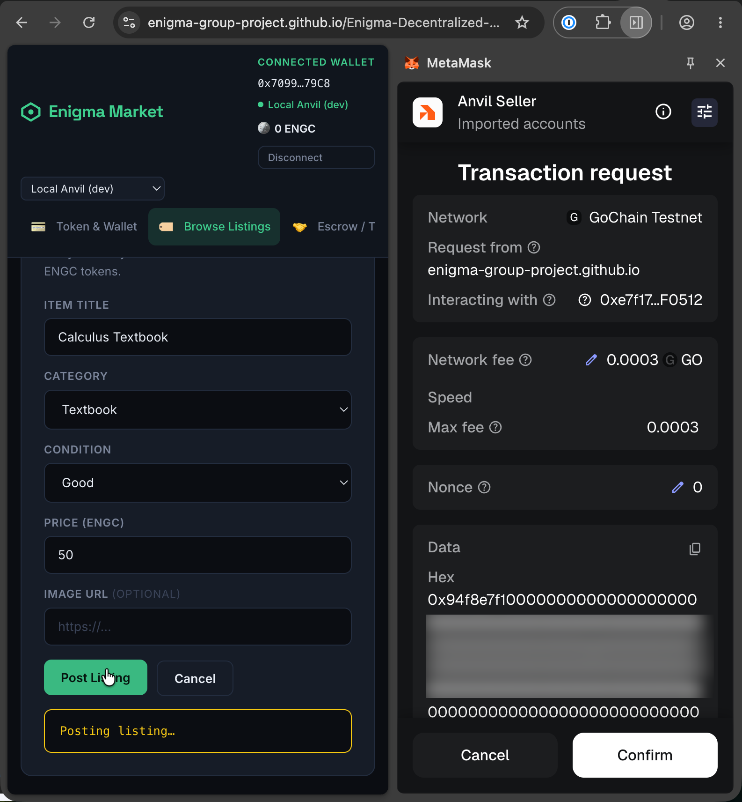

2. **Escrow / Trade** (`/modules/market/`) — as **buyer**, **Approve** then **Purchase** (or one-step permit) → listing moves to **Pending**; then **Confirm delivery** → **Sold**, seller paid.

   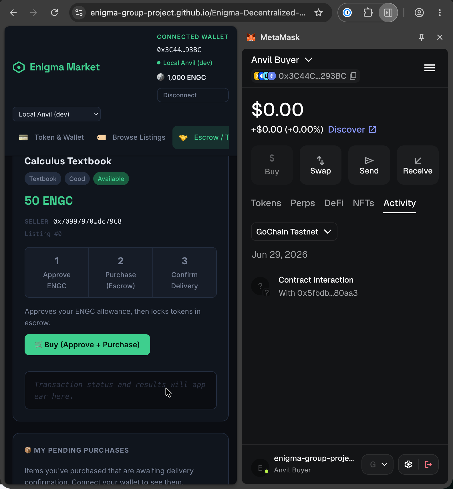

   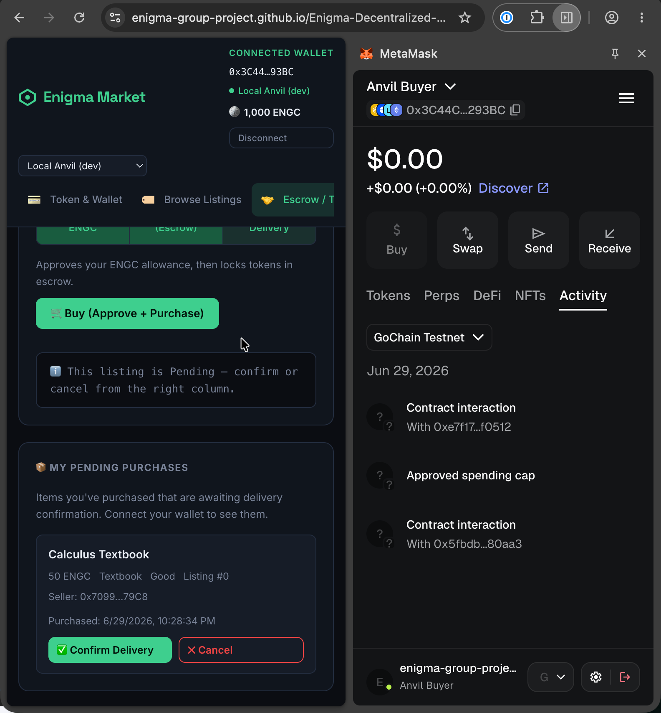

3. **Reputation** (`/modules/reputation/`) — as **buyer**, submit a **1–5★** rating → the seller's average updates.

   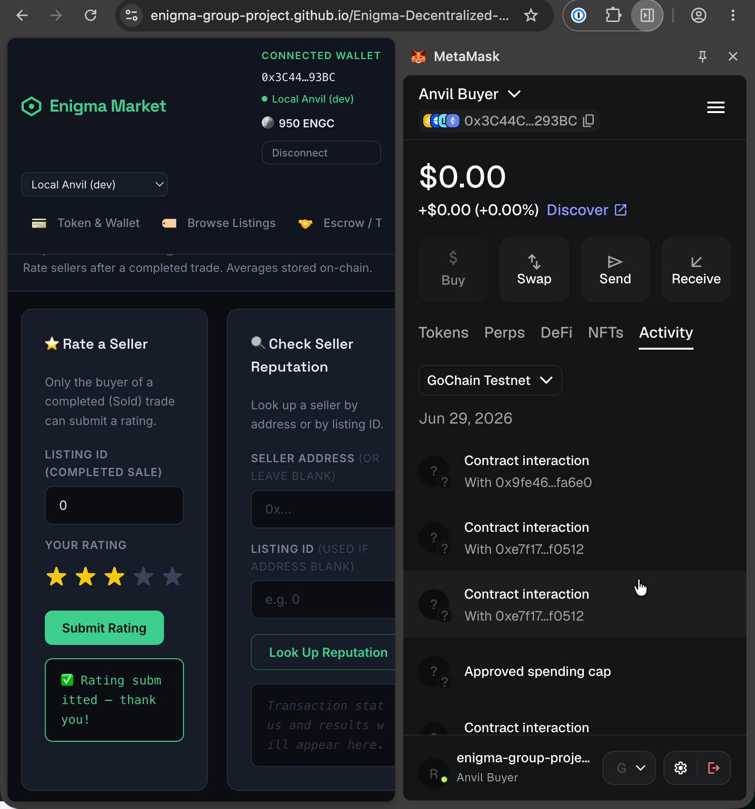

---

## D · Marketplace Lifecycle Test (Slices 2–4) — Hosted Sepolia

Same flow on the **live** site, driven entirely through the GUI — every action is a real Sepolia
transaction (~12–15s, real gas).

### D1. Roles & funding
- **Seller / buyer**: any two Sepolia accounts. Each needs a little **Sepolia ETH** for gas; the **buyer**
  also needs **ENGC** — click **Get 1,000 ENGC** (faucet) on the token page, or use a pre-funded demo wallet.
- No deploy/serve needed — the contracts are already live (`config.js` `sepolia` block) and published on Pages.

### D2. Run the lifecycle
On the hosted site, switch MetaMask to **Ethereum Sepolia** and set the page's network dropdown to
**Sepolia (hosted demo)** for each step:

1. **Listings** — seller creates a listing → confirm in MetaMask → appears under **Available**.

   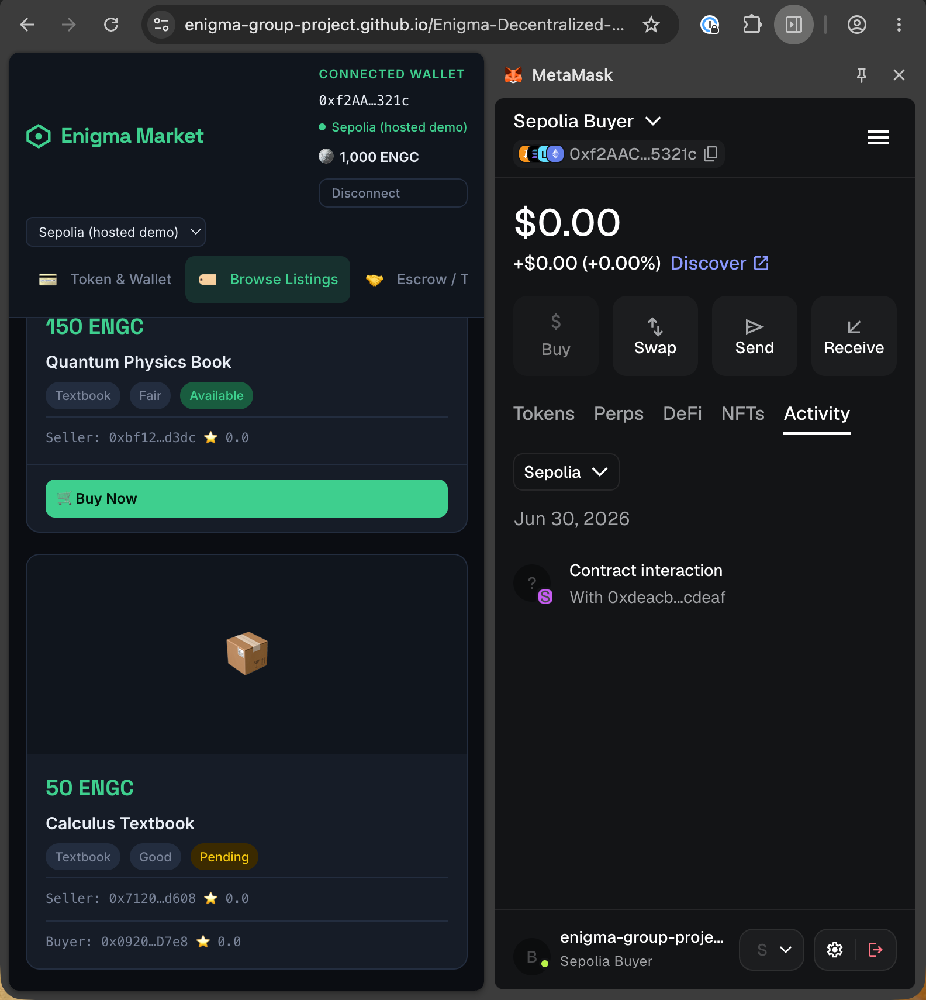

2. **Escrow / Trade** — buyer **Approve + Purchase** → **Pending**; then **Confirm delivery** → **Sold**.

   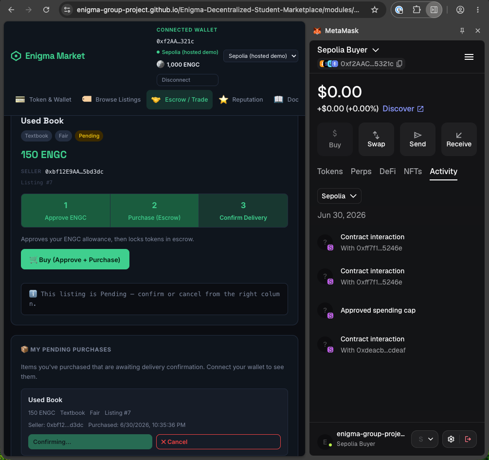

3. **Reputation** — buyer rates the seller **1–5★** → average updates.

   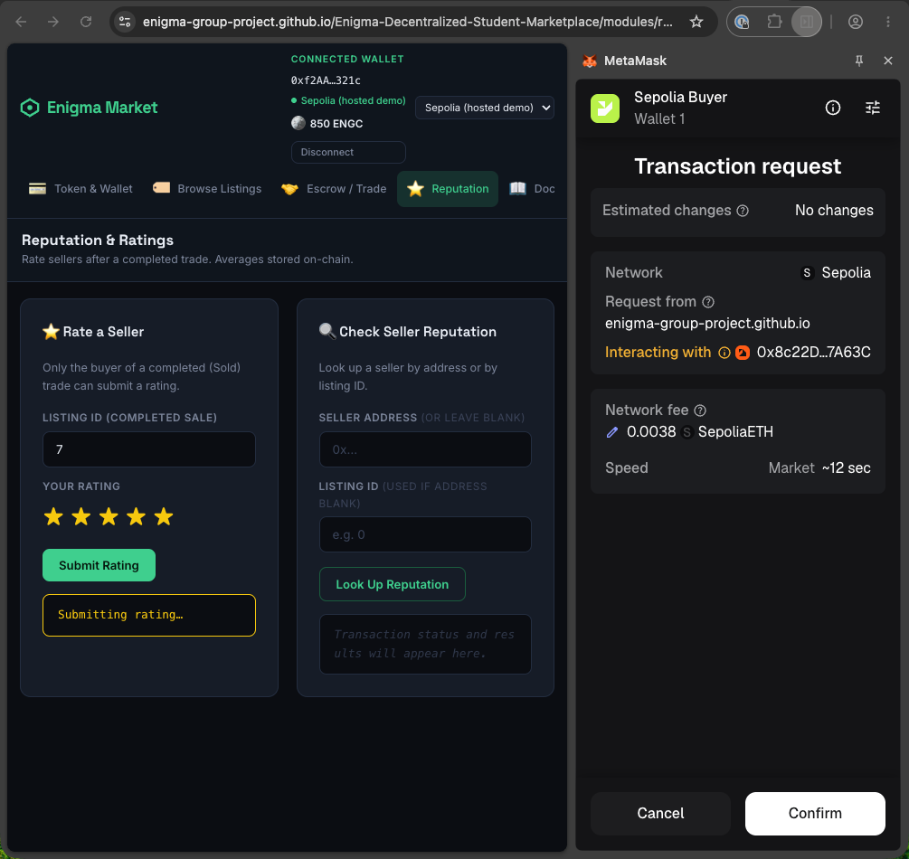

   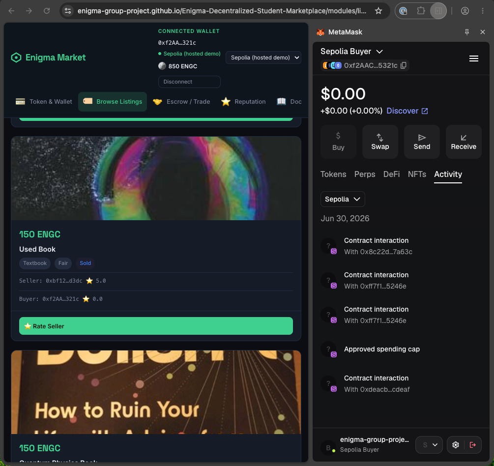

Verify independently on **[Sepolia Etherscan](https://sepolia.etherscan.io)**: the Marketplace holds the
price while *Pending*, transfers it to the seller on *Sold*, and `Reputation` records the rating.

> ✅ **Validated:** the full list → escrow → confirm → rate lifecycle works on the public testnet through the
> hosted GUI, with on-chain escrow custody you can verify on Etherscan.

---

## Why Anvil uses the *local* page (not the hosted URL)

The hosted page is served over **HTTPS**; the frontend reads balances via a direct call to the network's
`rpcUrl`. Sepolia's RPC is **public HTTPS**, so the hosted site reaches it fine. Anvil's RPC is
**`http://127.0.0.1:8545`** — the browser's **Private Network Access** policy blocks a public HTTPS page
from calling a local/loopback address, so balance reads fail. That's why **Anvil → local page**,
**Sepolia → hosted page**.

---

_See also: `PROCEDURES.md` (§A5b Anvil CLI walkthrough, §B3a Alchemy RPC) and `CONTRIBUTING.md` (PR workflow)._
